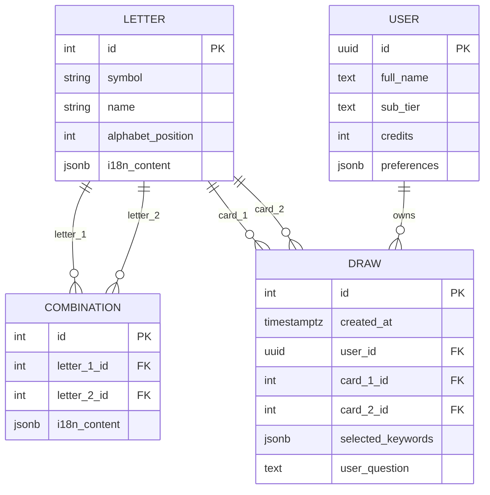
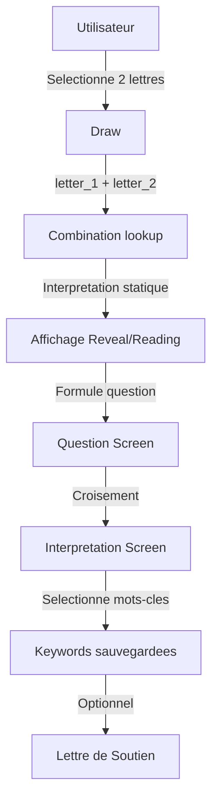

# Data Schema -- Diagramme de Relations



---

## Flux de Donnees



---

## Glyphes (Assets Statiques)

```
public/fonts/
├── Lalou/             (22 fichiers PNG bitmap, paddes) [DEFAUT]
│   ├── 01.png         (Aleph)
│   ├── 02.png         (Beth)
│   └── ...            (jusqu'a 22.png = Tav)
├── Biblical/          (22 fichiers SVG vectoriels, non-paddes)
│   ├── 1.svg          (Aleph)
│   ├── 2.svg          (Beth)
│   └── ...            (jusqu'a 22.svg = Tav)
└── Modern/            (22 fichiers SVG vectoriels, non-paddes)
    ├── 1.svg          (Aleph)
    ├── 2.svg          (Beth)
    └── ...            (jusqu'a 22.svg = Tav)
```
