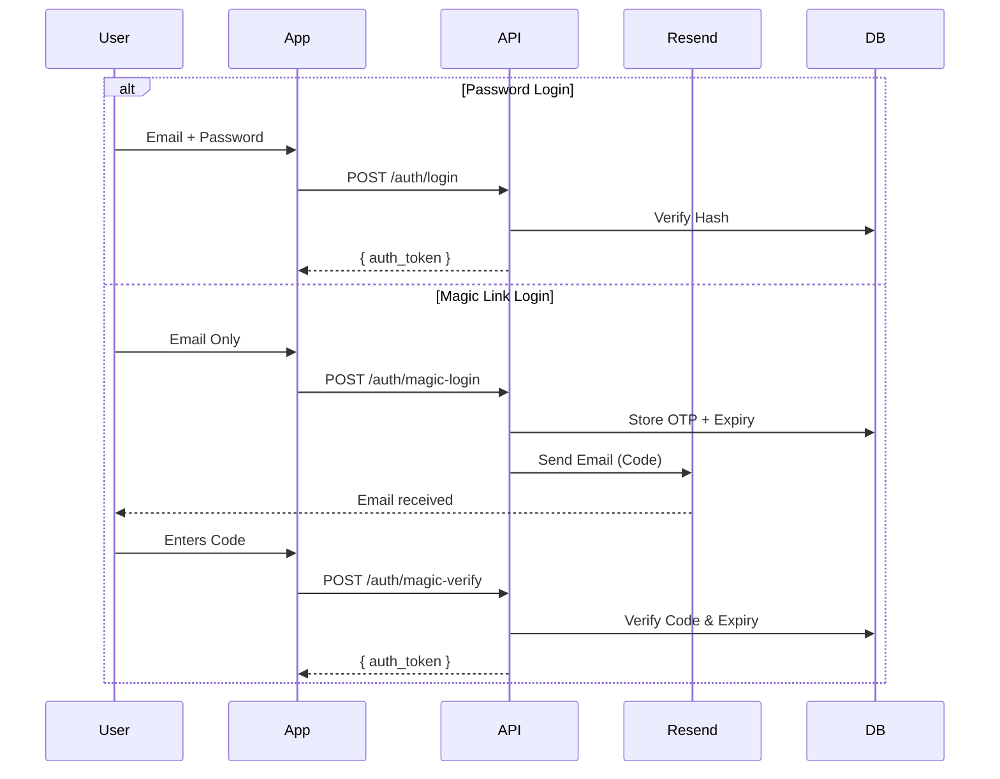
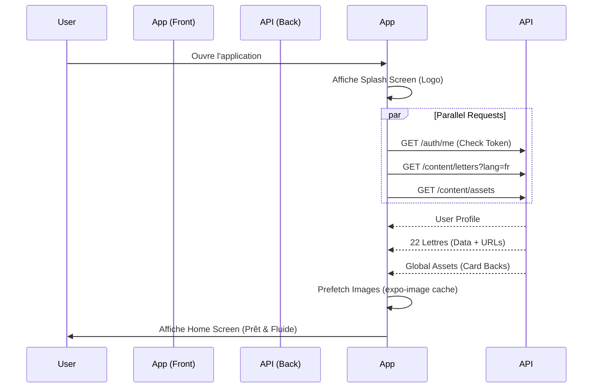
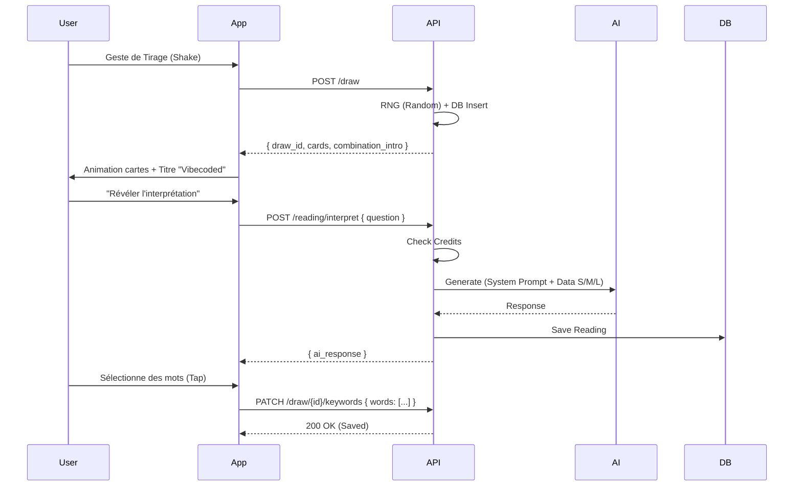

# Tech_Notice - Spécifications Techniques Détaillées
**Projet : Zohar Card**
**Date : 2026-01-05**
**Version : 1.0**

Ce document technique sert de référence pour l'implémentation, la maintenance et l'évolution de l'infrastructure backend et frontend de l'application Zohar Card. Il compile les logiques dispersées dans le PRD pour offrir une vue unifiée.

---

## 1. Architecture Générale

L'application repose sur le paradigme **"Vibecoding"**, privilégiant la fluidité, l'esthétique et une séparation stricte entre une **UI Client Statique** et un **Contenu Serveur Dynamique**.

### 1.1 Stack Technologique
*   **Frontend** : Expo (React Native) + TypeScript.
    *   *Rôle* : Affichage, Navigation, Logique de présentation.
    *   *System Design* : Voir **[`03_frontend_spec.md`](./03_frontend_spec.md)** et Tokens.
    *   *i18n* : `i18next` (Textes UI).
    *   *Cache* : `expo-image` (Assets).
    *   *Notifs* : **Expo Notifications** (Native Push).
*   **Backend** : Xano (No-Code Backend).
    *   *Rôle* : Base de données, Auth, Logique métier, Orchestration IA.
    *   *i18n* : "Smart API" (Sert le contenu déjà traduit).
*   **Intelligence** : OpenAI / Anthropic (via API Xano).
    *   *Rôle* : Génération d'interprétations contextuelles.

### 1.2 Flux de Données
1.  **UI Request** : Le mobile demande une donnée (ex: `GET /content/letters?lang=fr`).
3.  **Smart Resolution** : Xano interroge la DB.
    *   Si `lang` est présent : Il filtre la bonne langue et **aplatit** la structure (`{ "name": "Aleph" }`).
    *   Si `lang` est absent : Il renvoie le JSON complet (`{ "i18n": { "fr": ... } }`).
4.  **Clean Response** : Le mobile reçoit exactement ce dont il a besoin (pour affichage ou cache).

### 1.3 Notifications (Native)
*   **Provider** : Expo Push API.
*   **Flow** :
    1.  Front: `getExpoPushTokenAsync()` -> `PATCH /user/profile` (Save token).
    2.  Back (Xano) : Trigger Function -> HTTP Request `POST https://exp.host/--/api/v2/push/send`.
    3.  User : Reçoit la notif native.

---

## 2. Base de Données (Détail Structurel)

La base est relationnelle mais utilise fortement le type **JSON** pour la flexibilité (i18n, configs).

### 2.1 Schéma Relationnel
*Voir `01_data_schema.mermaid.md` pour le diagramme visuel.*

#### **User** (Utilisateurs)
*Table centrale. Gère l'accès et l'état.*
*   `id` (int): Clé primaire.
*   `email` (text): Unique. Login.
*   `password` (password): Hash sécurisé.
*   `credits` (int): Solde courant pour appels IA (Défaut: 2).
*   `sub_tier` (enum): `free`, `light`, `plus`, `unlimited`. Détermine les droits.
*   `preferences` (json): Stocke les réglages locaux synchronisés (Thème, Langue, Notifications).

#### **Letter** (Lettres Hébraïques)
*Données Statiques (Reference Data). 22 enregistrements.*
*   `id` (int): Clé primaire.
*   `symbol` (text): Caractère (ex: א).
*   `visual_content` (json): URLs des faces de cartes.
    *   Format: `{ "classic": "https://cdn.../aleph_c.png", "modern": "..." }`
*   `i18n_content` (json): Textes riches multi-langues.
    *   Format: `{ "fr": { "content_short": "...", "identity": {...}, "symbolic_essence": {...} } }`

#### **Combination** (Paires)
*Données Statiques. 462 enregistrements.*
*   `position_1_id` (fk): Agent (Droite).
*   `position_2_id` (fk): Patient (Gauche).
*   `i18n_content` (json): Interprétation de la dynamique spécifique.
    *   Format: `{ "fr": { "title": "...", "pair_essence": {...}, "reading_frames": {...} } }`

#### **Draw** (Tirages)
*Historique technique.*
*   `user_id` (fk): L'auteur.
*   `card_1_id` (fk), `card_2_id` (fk): Les résultats du RNG.
*   `style` (text): Le layout utilisé (chaos, grid).
*   `selected_keywords` (json): Array de strings. Les mots qui ont résonné pour l'utilisateur.

#### **Reading** (Lectures)
*Contenu généré (ou statique riche) délivré à l'utilisateur.*
*   `draw_id` (fk): Lien vers le tirage.
*   `user_question` (text): Input optionnel.
*   `ai_interpretation` (text): Sortie du LLM.
*   `meta` (json): Debug info (tokens, model version).

#### **AppAsset** (Ressources Globales)
*Table de configuration visuelle dynamique.*
*   `key` (text): Identifiant unique (ex: `card_back_cosmos`).
*   `type` (enum): `card_back`, `background`, `sound`.
*   `url` (image): Le fichier CDN.

---

## 3. API & Endpoints (Spécifications)

Base URL: `https://api.najman.app/api:hyEJD2He`

### 3.1 Authentification
Toute requête authentifiée doit fournir le header: `Authorization: Bearer <token>`



*   `POST /auth/signup` : Création de compte (Password).
*   `GET /auth/me` : Récupération du profil complet (`Authorization: Bearer`). Renvoie l'objet `user` contenant un objet imbriqué `profile`. Ce endpoint centralise la récupération des données utilisateur en une seule requête (plus de requête séparée sur `/profile`).

### 3.2 Contenu (Smart Delivery)
Ces endpoints suivent la **Règle Universelle de Langue** (voir `04_backend_spec.md`).

*   **Règle** : `?lang=fr` -> Filtre & Aplatit. Pas de param -> Renvoie Full JSON.
*   `GET /letter`
    *   Use Case: Au lancement (Splash) pour précharger les textes et URLs. (22 entrées)
    *   Logic: Renvoie toute la table `Letter`. Si `lang` est fourni, retourne le contenu localisé aplati. (Non authentifié)
*   `GET /letter/symbol/{symbol}`
    *   Use Case: Récupération ciblée par glyphe (ex: 'א').
    *   Logic: Filtre par symbole + Flattening i18n si `lang` est fourni. (Authentifié)
*   `GET /letter/{letter_id}`
    *   Use Case: Récupération d'une seule lettre par ID (1-22).
    *   Logic: Filtre par ID + Flattening i18n si `lang` est fourni. (Authentifié)
*   `GET /combination/symbol/{symbol_1}/{symbol_2}`
    *   Use Case: Récupération ciblée du contenu d'une combinaison de deux lettres (ex: א et ב).
    *   Logic: Filtre par les symboles respectifs (position 1 et 2). Si `lang` est fourni (`?lang=fr`), le backend renvoie le contenu déjà aplati pour la langue spécifiée. Si l'appel échoue (ex: combinaison non trouvée 404), le frontend bascule automatiquement sur un fallback local généré à la volée.
*   `GET /content/assets`
    *   Use Case: Au lancement, récupérer les Dos (Card Backs) actifs.
    *   Response: `[ { "key": "card_back_cosmos", "url": "..." }, ... ]`


### 3.3 Core Flows (Tirage & Lecture)

#### **1. Faire un Tirage (Le Rituel)**
*   **Endpoint** : `POST /draw`
*   **Trigger** : Utilisateur complète le geste (shake/tap).
*   **Backend Logic** :
    1.  Génère 2 nombres aléatoires (1-22) distincts.
    2.  Crée une entrée `Draw`.
    3.  Récupère les infos statiques de la `Combination` associée.
*   **Response** :
    ```json
    {
      "draw_id": 105,
      "cards": [
        { "id": 1, "symbol": "א", "visual_url": "..." },
        { "id": 4, "symbol": "ד", "visual_url": "..." }
      ],
      "combination_intro": {
        "title": "Le Commencement de la Porte",
        "short_text": "Une ouverture se crée..."
      }
    }
    ```

#### **2. Demander l'Interprétation (L'Intelligence)**
*   **Endpoint** : `POST /reading/interpret`
*   **Trigger** : Utilisateur pose une question ou clique "Révéler".
*   **Input** : `{ "draw_id": 105, "question": "Vais-je réussir ?" }`
*   **Backend Logic** :
    1.  Vérifie `user.credits >= 3`. Si les crédits sont insuffisants, l'UI doit proposer un retour ou un achat.
    2.  Décrémente les crédits de 3 (logique future, simulée pour la maquette).
    3.  Construit le **System Prompt** avec :
        *   Les définitions complètes des 2 lettres (Base de connaissance).
        *   La sémantique de la Combinaison (`pair_essence`, `reading_frames`).
        *   Les *Guardrails* (Pas de prédiction, pas de conseil médical).
    4.  Appelle OpenAI/Claude.
    5.  Sauvegarde dans `Reading`.
*   **Response** :
    ```json
    {
      "reading_id": 88,
      "ai_response": "La rencontre de Aleph et Daleth suggère... (Markdown)",
      "credits_left": 4
    }
    ```

---

## 4. Flows Applicatifs (Exemples)

### 4.1 Flow de Démarrage (Fluidity First)
L'objectif est d'éliminer les temps de chargement perçus.



### 4.2 Flow de Tirage (Rituel)
Séparation de l'acte technique (Draw) de l'acte intellectuel (Reading) pour gérer la latence IA.



---

## 5. Sécurité & Guardrails

### 5.1 Gestion des Jetons (Tokens)
*   Aucun calcul critique (RNG, Crédits) n'est fait côté client.
*   Le token JWT assure que l'utilisateur ne peut pas modifier son propre solde de crédits.

### 5.2 Protection IA (Guardrails)
*   Le "System Prompt" injecté par le backend contient les règles éthiques strictes (`05_guardrails.md`).
*   L'utilisateur ne parle jamais directement à l'IA; il parle à l'API qui *filtre et cadre* la requête.

### 5.3 Logs
*   Utilisation de `POST /log/user` pour remonter les crashs ou erreurs critiques du client vers la table `UserLog`, permettant un débogage proactif sans accès physique au device de l'utilisateur.

---

## 6. Outils et Scripts d'Administration

### 6.1 Générateur de Combinaisons
Un script local Node.js (`scripts/generate_combinations.js`) est utilisé pour pré-générer les combinaisons manquantes via l'API OpenAI (GPT-4o) et les injecter directement dans la base Xano.
*   **Fonctionnement** : Le script interroge d'abord la base Xano (`GET /combination`) pour recenser les paires déjà créées. Il itère ensuite sur les paires restantes, appelle l'API d'OpenAI avec un prompt détaillé contenant la sémantique de chaque lettre, puis poste le résultat structuré en JSON (anglais et français) sur Xano via `POST /combination`.
*   **Usage** : `node scripts/generate_combinations.js` (nécessite `.env` avec `OPENAI_API_KEY`).
